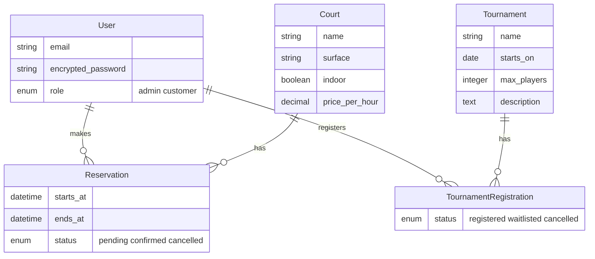
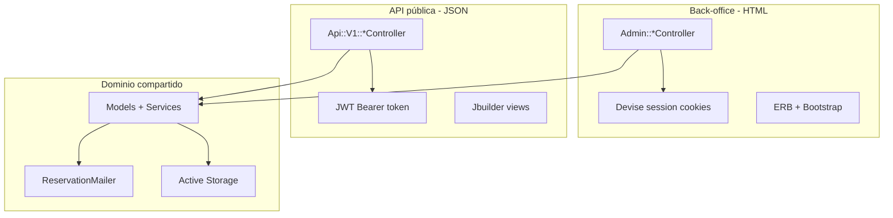

# Plan de implementación — Ok Padel (TP1 Programación IV)

## Estado actual

El repositorio [`ok_padel`](.) es un `rails new` con tooling listo (RuboCop, Brakeman, CI, Docker/Kamal) y gems **declaradas** en [`Gemfile`](Gemfile) (`devise`, `jwt`, `rspec-rails`, `bootstrap`, etc.) pero **sin instalar ni configurar** (`Gemfile.lock` desactualizado). No hay modelos de dominio, rutas, controladores ni tests.

---

## Dominio propuesto: club de pádel

**Ok Padel** gestiona canchas, reservas y torneos. Un solo modelo `User` con roles cubre admin (back-office) y cliente (API).



### Modelos (5 principales + join)

| Modelo | Propósito | Relaciones clave |
|--------|-----------|------------------|
| `User` | Admin y cliente | `has_many :reservations`, `has_many :tournament_registrations` |
| `Court` | Canchas del club | `has_many :reservations`, `has_one_attached :image` |
| `Reservation` | Reserva de cancha | `belongs_to :user`, `belongs_to :court` |
| `Tournament` | Torneos | `has_many :tournament_registrations`, `has_many :users, through:` |
| `TournamentRegistration` | Inscripción a torneo | `belongs_to :user`, `belongs_to :tournament` |

### Validaciones de negocio importantes

- **User**: email único, presencia de nombre; rol obligatorio (`admin` / `customer`)
- **Court**: nombre único, `price_per_hour > 0`, imagen opcional con `active_storage_validations` (tipo/tamaño)
- **Reservation**: `ends_at > starts_at`, no solapamiento en la misma cancha, no reservas en el pasado (creación)
- **Tournament**: `max_players > 0`, `starts_on` futuro al crear
- **TournamentRegistration**: unicidad `user + tournament`, cupo máximo del torneo

---

## Arquitectura de capas



Separación clara: controladores admin en [`app/controllers/admin/`](app/controllers/admin/), API en [`app/controllers/api/v1/`](app/controllers/api/v1/), lógica compartida en modelos y un servicio opcional [`app/services/reservations/creator.rb`](app/services/reservations/creator.rb) para la lógica de solapamiento.

---

## Etapa 0 — Setup inicial (día 1)

1. `bundle install` para sincronizar gems
2. `rails active_storage:install` + `rails db:create db:migrate`
3. `rails generate rspec:install`
4. `rails generate devise:install` + `rails generate devise User role:integer`
5. Configurar Bootstrap + Sass en [`app/assets/stylesheets/`](app/assets/stylesheets/)
6. Configurar `letter_opener` en [`config/environments/development.rb`](config/environments/development.rb)
7. Crear concern JWT: [`app/controllers/concerns/jwt_authenticatable.rb`](app/controllers/concerns/jwt_authenticatable.rb)
8. Base controllers:
   - [`app/controllers/admin/base_controller.rb`](app/controllers/admin/base_controller.rb) — `before_action :authenticate_user!`, `before_action :require_admin!`
   - [`app/controllers/api/v1/base_controller.rb`](app/controllers/api/v1/base_controller.rb) — JSON responses, manejo de errores HTTP

---

## Etapa 1 — Modelos y base de datos

Generar migraciones y modelos con `rails g model` / `rails g migration`, luego seeds en [`db/seeds.rb`](db/seeds.rb):

- 1 admin: `admin@okpadel.com` / password documentada en README
- 2-3 clientes de prueba
- 3-4 canchas con imágenes de ejemplo
- Reservas y torneos de muestra

Verificar en `rails console` que asociaciones y validaciones funcionan antes de continuar.

---

## Etapa 2 — Back-office (`namespace :admin`)

### Rutas ([`config/routes.rb`](config/routes.rb))

```ruby
devise_for :users, skip: [:registrations]  # solo login admin en back-office

namespace :admin do
  root "dashboard#index"
  resources :courts
  resources :reservations
  resources :tournaments do
    resources :tournament_registrations, only: [:index, :destroy]
  end
  resources :users, only: [:index, :show, :edit, :update]
end
```

### Controladores y vistas

| Recurso | CRUD | Extras |
|---------|------|--------|
| `Courts` | Completo | Upload de imagen, Pagy en index |
| `Reservations` | Completo | Filtros por estado/cancha |
| `Tournaments` | Completo | Ver inscriptos anidados |
| `Users` | Index/show/edit | Solo clientes, cambiar rol con cuidado |
| `Dashboard` | — | Resumen: reservas del día, torneos próximos |

- Layout admin: [`app/views/layouts/admin.html.erb`](app/views/layouts/admin.html.erb) con navbar Bootstrap
- Flash messages, formularios con `form_with`, partials `_form.html.erb`
- Protección: redirigir no-admins a root con mensaje de error

---

## Etapa 3 — API JSON (`namespace :api/v1`)

### Rutas

```ruby
namespace :api do
  namespace :v1 do
    post "login",    to: "sessions#create"
    delete "logout", to: "sessions#destroy"
    get  "profile",  to: "users#show"
    patch "profile", to: "users#update"

    resources :courts, only: [:index, :show]
    resources :tournaments, only: [:index, :show] do
      post :register, on: :member
      delete :unregister, on: :member
    end
    resources :reservations, only: [:index, :show, :create, :destroy]
  end
end
```

### Autenticación JWT

- `POST /api/v1/login` — body: `{ email, password }` → `{ token, user: { id, name, email } }`
- Token firmado con `Rails.application.secret_key_base` (o credencial dedicada), expiración 24h
- Requests protegidos: header `Authorization: Bearer <token>`
- Errores consistentes: `{ error: "mensaje" }` con códigos 401, 403, 422, 404

### Vistas JSON

Usar Jbuilder en [`app/views/api/v1/`](app/views/api/v1/) para no exponer campos sensibles (`encrypted_password`, `role` en endpoints públicos).

### Endpoints principales para el TP2

| Método | Endpoint | Auth | Descripción |
|--------|----------|------|-------------|
| POST | `/api/v1/login` | No | Obtener JWT |
| GET | `/api/v1/profile` | Sí | Perfil del usuario |
| GET | `/api/v1/courts` | No | Listar canchas con URL de imagen |
| GET | `/api/v1/courts/:id` | No | Detalle de cancha |
| GET | `/api/v1/reservations` | Sí | Mis reservas |
| POST | `/api/v1/reservations` | Sí | Crear reserva |
| DELETE | `/api/v1/reservations/:id` | Sí | Cancelar reserva propia |
| GET | `/api/v1/tournaments` | No | Torneos disponibles |
| POST | `/api/v1/tournaments/:id/register` | Sí | Inscribirse |

---

## Etapa 4 — Active Storage y Action Mailer

### Active Storage

- `Court` → `has_one_attached :image`
- Validación: `content_type: [:png, :jpg, :jpeg, :webp]`, `size: { less_than: 5.megabytes }`
- Admin: campo file en formulario de cancha
- API: incluir `image_url` en JSON (helper con `url_for` o `rails_blob_url`)

### Action Mailer

- [`app/mailers/reservation_mailer.rb`](app/mailers/reservation_mailer.rb)
- Trigger: `after_create_commit` en `Reservation` (o desde servicio de creación)
- Email `confirmation` al usuario con cancha, fecha/hora y estado
- Vista HTML + texto en [`app/views/reservation_mailer/`](app/views/reservation_mailer/)
- Dev: `letter_opener` abre en navegador

---

## Etapa 5 — Testing (RSpec)

Mínimo exigido por el TP:

| Archivo | Qué testear |
|---------|-------------|
| `spec/models/court_spec.rb` | Validaciones de presencia, precio positivo |
| `spec/models/reservation_spec.rb` | Solapamiento, fechas inválidas |
| `spec/models/tournament_registration_spec.rb` | Cupo máximo, unicidad |
| `spec/models/user_spec.rb` | Roles, validaciones Devise |
| `spec/requests/api/v1/sessions_spec.rb` | Login exitoso / credenciales inválidas |
| `spec/requests/api/v1/reservations_spec.rb` | Crear reserva autenticado, 401 sin token |

Usar `factory_bot` + `faker` en [`spec/factories/`](spec/factories/), `shoulda-matchers` para asociaciones/validaciones.

Agregar job de tests a [`.github/workflows/ci.yml`](.github/workflows/ci.yml): `bundle exec rspec`.

---

## Etapa 6 — Calidad y seguridad

Ya configurado: [`.rubocop.yml`](.rubocop.yml) (Omakase), `bin/brakeman`, CI en GitHub Actions.

Antes de entrega:

1. `bin/rubocop -A` — corregir ofensas automáticas; documentar ignores en `.rubocop.yml` si hace falta
2. `bin/brakeman --no-pager` — revisar advertencias; justificar en README o `config/brakeman.ignore` las inevitables (ej. mass assignment si se usa `params.expect`)
3. `bin/ci` — pipeline completo local

---

## Etapa 7 — README y entrega

Reescribir [`README.md`](README.md) con:

- Descripción del dominio y diagrama de modelos
- Ruby 3.4.10 / Rails 8.1.3
- Setup: `bundle install`, `rails db:setup`, `bin/dev`
- Credenciales admin de seeds
- Tabla de endpoints API con ejemplos `curl`
- Comandos: `rspec`, `rubocop`, `brakeman`
- URL de deploy (opcional)

### Deploy opcional

El proyecto ya tiene [`config/deploy.yml`](config/deploy.yml) (Kamal) y [`Dockerfile`](Dockerfile). Alternativa gratuita: Render o Railway con PostgreSQL. Configurar `RAILS_MASTER_KEY` y servicio de disco para Active Storage.

---

## Cronograma sugerido (fechas del TP)

| Fecha | Hito | Entregable |
|-------|------|------------|
| **2–8 sep** | Etapas 0–1 | Gems instaladas, modelos, seeds, console OK |
| **9–16 sep** | Etapa 2 | **Checkpoint 16 sep**: back-office CRUD + Devise admin |
| **17–23 sep** | Etapas 3–4 | API JWT + Active Storage + Mailer |
| **24–28 sep** | Etapas 5–6 | Tests + RuboCop/Brakeman limpios |
| **29–30 sep** | Etapa 7 | README completo, deploy opcional, **entrega 30 sep** |

---

## Extras opcionales (puntos adicionales)

Prioridad sugerida si hay tiempo:

1. **Swagger** (`rswag`) — documentación interactiva de la API
2. **Active Job** — enviar email de confirmación en background (`deliver_later`)
3. **Hotwire/Turbo** — confirmaciones inline en admin sin JS manual (ya está Turbo en el stack)

---

## Archivos clave a crear/modificar

| Área | Archivos principales |
|------|---------------------|
| Modelos | `app/models/user.rb`, `court.rb`, `reservation.rb`, `tournament.rb`, `tournament_registration.rb` |
| Admin | `app/controllers/admin/*`, `app/views/admin/**` |
| API | `app/controllers/api/v1/*`, `app/views/api/v1/**` |
| Auth | `app/controllers/concerns/jwt_authenticatable.rb`, Devise config |
| Mailer | `app/mailers/reservation_mailer.rb` |
| Tests | `spec/models/*`, `spec/requests/api/v1/*`, `spec/factories/*` |
| Config | `config/routes.rb`, `db/seeds.rb`, `README.md` |
